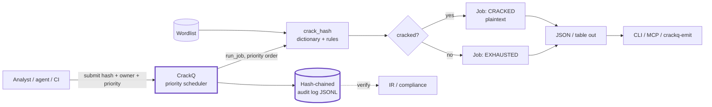
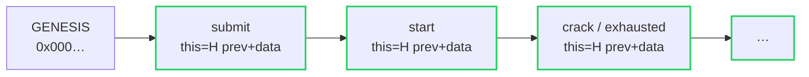
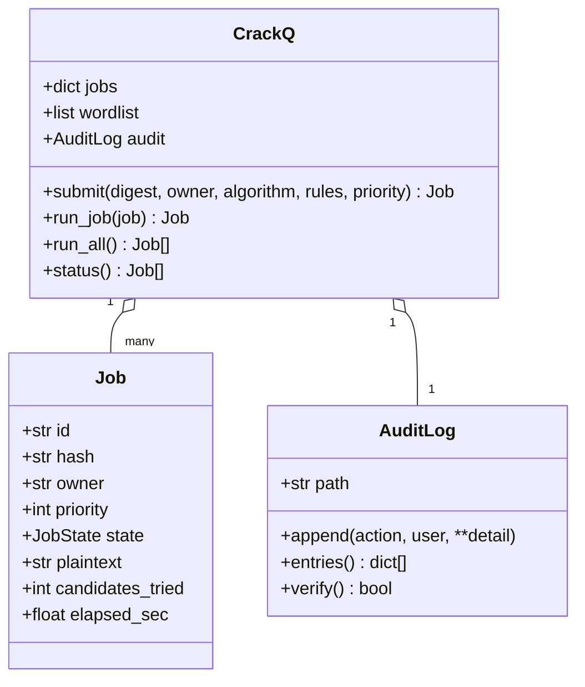

# Architecture

`crackq` is a self-hosted, multi-user password-cracking **queue**: submit hashes
you are authorized to test, and a priority scheduler drains them against a
wordlist with rule mangling, recording every state transition to a
tamper-evident audit log. This document explains how the pieces fit together.

> **Authorized / defensive use only.** Run it against hashes you own or are
> explicitly authorized to audit. See [`../DISCLAIMER.md`](../DISCLAIMER.md).

## The pipeline

## Components

### Crack engine (`crackq/core.py` — `crack_hash`)
An honest dictionary attack over an attacker-supplied wordlist using stdlib
`hashlib` (`md5`, `sha1`, `sha256`, `sha512`). For each word it yields the base
candidate and — when `rules=True` — common mangles (capitalize, upper, reverse,
leet, and digit/`!`/year appends), the same primitive a real queue hands to
`hashcat -a 0`. It returns the outcome plus `candidates_tried` and `elapsed_sec`
so every job is accountable. Algorithm is auto-detected from digest length when
not given (`detect_algorithm`).

### Job & JobState (`crackq/core.py`)
A `Job` is a queued work item: `hash`, `owner`, `algorithm`, `rules`,
`priority` (lower = sooner), plus result fields filled in as it runs. `JobState`
moves `QUEUED → RUNNING → {CRACKED, EXHAUSTED, FAILED}`.

### Queue & scheduler (`crackq/core.py` — `CrackQ`)
The multi-user core. `submit()` enqueues a job for an owner and logs it;
`_next()` selects the next job by `(priority, created_at)` so an incident job
jumps ahead of routine work while equal-priority jobs stay FIFO; `run_job()`
runs one job and records the transition; `run_all()` drains the queue;
`status()` lists jobs. `load_wordlist()` reads a wordlist file once and shares
it across jobs.

### Audit log (`crackq/core.py` — `AuditLog`)
An append-only, hash-chained JSONL log. Each record stores the SHA-256 of the
previous record (`prev`) and its own digest (`this`), so any edit, deletion, or
reordering is detectable. `verify()` walks the chain and raises `AuditError` at
the first tampered record. This is what makes "who cracked what, and when" a
provable fact.

### CLI (`crackq/cli.py`)
The scriptable front door. `run` submits hashes (`--hash`/`--hashfile`/`--words`/
`--wordlist`) and drains the queue, emitting `table` or `json`; exit code is `1`
if any job failed (bad algo / error), `0` otherwise. `audit` prints or
`--verify`s the log; `algos` lists supported algorithms.

### Interop (`crackq/connect.py`, `crackq/mcp_server.py`)
`crackq-emit` maps the JSON output to the canonical `Finding` and forwards it via
`cognis-connect` (STIX/MISP/Sigma/Splunk/Elastic/Slack/webhook) — a soft,
optional dependency. An MCP server entry point exposes the tool to AI agents.

## Data model

## Why these choices

- **A queue, not a one-shot.** Cracking is shared, prioritized work; the
  scheduler is the product, the dictionary attack is just the primitive.
- **Offline by construction.** Nothing here touches the network. Hashes,
  wordlist, and audit log are local files you can copy, diff, and ship.
- **Provable by default.** The audit chain is the path every transition takes,
  not a feature bolted on — so credential audits stand up as evidence.
